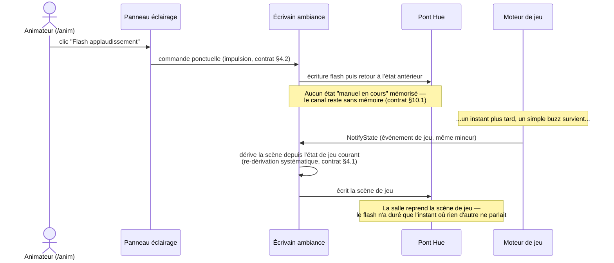

# Éclairage — priorité conduite manuelle ↔ scènes automatiques, et cycle de restitution (#208)

> Support 2 de la maquette T1.3 (Batch 1, reprise milestone v10.0.0). Complète
> `docs/mockups/lighting-team-assignment-213.html` §03. Référence normative :
> `contracts/lighting.md` §10, décisions actées dans
> `_work/handoff/gate1-decisions-v10-20260907.md`.

## 1. Pourquoi un diagramme de séquence, pas une machine à états

La décision utilisateur du 2026-09-07 a délibérément aplati ce qui aurait pu être une machine à
états (« la conduite manuelle tient jusqu'à quoi ? ») en une règle sans mémoire :
**la conduite manuelle est écrasée par le tout prochain événement de jeu, sans exception et sans
tenue.** Il n'y a donc ni état « conduite manuelle active », ni transition à représenter — seulement
un ordre d'écritures sur le même canal. Un diagramme de séquence le montre mieux qu'un paragraphe.

## 2. Priorité — écrasement immédiat par le prochain événement

**Ce que ce diagramme rend visible :** il n'existe pas de branche « le jeu attend que la conduite
manuelle se termine ». La commande manuelle et la scène de jeu écrivent dans le **même** canal, à la
suite l'une de l'autre — la dernière écriture gagne, point final. Introduire une variable
« source de la dernière commande » ou une temporisation de tenue ajouterait un état que rien, côté
serveur, ne consulterait jamais (contrat §10.1).

## 3. Cycle de restitution — trois situations, une seule qui agit

```mermaid
sequenceDiagram
    participant Game as Moteur de jeu
    participant App as (*App).stop()
    participant Writer as Écrivain ambiance
    participant Hue as Pont Hue
    participant Buzz as LED buzzers

    rect rgb(30, 30, 30)
    Note over Game: Fin de partie
    Game->>Writer: (aucune action de restitution)
    Note over Writer,Hue: La dernière scène de jeu reste affichée.<br/>Hors périmètre v10.0.0 (contrat §10.2)
    end

    rect rgb(30, 30, 30)
    Note over Hue: Perte du pont en cours de partie
    Hue--xWriter: injoignable (timeout 2s)
    Writer->>Writer: n'agit pas sur l'éclairage — seul le badge<br/>de statut admin reflète la perte (hue-bridge.md §5.6)
    Note over Hue: ...le pont revient...
    Hue-->>Writer: reconnecté
    Writer->>Writer: déclenche un NotifyState de resynchronisation
    Writer->>Hue: réapplique la scène dérivée de l'état de jeu COURANT<br/>(jamais un état neutre, jamais la dernière scène connue — contrat §10.3)
    end

    rect rgb(58, 30, 12)
    Note over App: Arrêt du serveur — seul cas des trois qui agit
    App->>Writer: extinction totale, AVANT a.cancelCtx()
    Note over App,Writer: Contexte propre à échéance courte (1-2s),<br/>jamais a.ctx — contrat §10.4
    Writer->>Hue: éteint toutes les ampoules pilotées
    Writer->>Buzz: éteint les LED des buzzers
    App->>App: cancelCtx() — arrêt normal des autres composants
    Note over Hue,Buzz: Pont injoignable à l'arrêt = cas normal,<br/>au plus une ligne de log — n'empêche jamais l'arrêt
    end
```

**Ce que ce diagramme rend visible :** sur les trois situations qui auraient pu déclencher une
restitution, **une seule le fait**. Fin de partie et perte de pont sont volontairement des
non-événements pour l'éclairage — seul l'arrêt serveur agit, et il doit le faire **avant**
`cancelCtx()`, pas après, sous peine d'émettre une extinction sur un contexte déjà mort (piège
vérifié dans le code, contrat §10.4).

## 4. Table récapitulative (miroir texte du diagramme §3)

| Situation | Éclairage agit ? | Ce qui se passe |
|---|---|---|
| Fin de partie | Non | La dernière scène de jeu reste affichée |
| Perte du pont en cours de partie | Non (sur l'éclairage) | Badge de statut admin seul ; resynchronisation **au retour** du pont (§10.3) |
| Arrêt du serveur | **Oui — seul cas** | Extinction totale : ampoules Hue **et** LED buzzers, avant `cancelCtx()` |

## 5. Ce que ces diagrammes ne couvrent pas

- La résolution zone → ampoules et les quatre règles de dégradation (#213) : voir
  `docs/mockups/lighting-team-assignment-213.html` §01 et `contracts/hue-bridge.md` §5.7.
- Le contenu exact des scènes (couleurs, intensités) : table de scènes v1, `contracts/lighting.md`
  §8 — inchangée par #208.
- L'implémentation de la resynchronisation (§10.3) est volontairement minimale d'après le contrat :
  déclencher un `NotifyState` sur la transition de reconnexion suffit, la re-dérivation systématique
  fait le reste. Si l'implémentation réelle devient plus compliquée que ça, c'est un signal à
  remonter, pas à absorber silencieusement.

---
Maquette produite en phase Plan (T1.3, Batch 1) · révision 1 — à valider, GATE 2 · référence pour
dev-frontend (Batch 3), test-writer (T1.4) et qa · issue #208 · milestone v10.0.0 · BuzzControl
