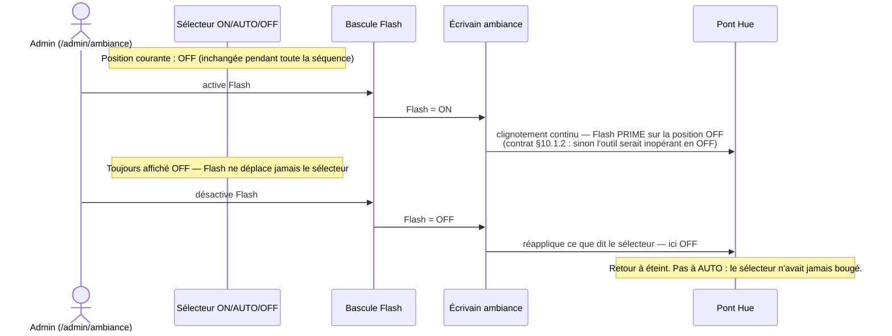

# Éclairage — mode manuel (ON/AUTO/OFF + Flash) et cycle de restitution (#208)

> Support 2 de la maquette T1.3 (Batch 1, reprise milestone v10.0.0). Complète
> `docs/mockups/lighting-team-assignment-213.html` §01/§03. Référence normative :
> `contracts/lighting.md` §10, SHA `41825c83` (en vigueur).

## 0. Ce document remplace une version obsolète

Une première version de ce diagramme montrait un **écrasement automatique** de la conduite
manuelle par le prochain événement de jeu — c'était le modèle envisagé quand ces commandes
vivaient encore sur `/anim`, avant la révision de périmètre du 2026-09-07
(`contracts/lighting.md` §10.1, « Historique des deux révisions de ce paragraphe »). Une
formulation intermédiaire (annulation automatique **avec** retour visuel du sélecteur) a même
existé un instant sur la branche (commit `1525c96a`) avant d'être revertée le jour même
(`41825c83`) — **elle n'a jamais été en vigueur**.

**Le design confirmé est l'inverse** : le mode **tient indéfiniment**, y compris pendant une
partie. Seul un retour **manuel** sur **AUTO** — ou l'arrêt du serveur — rend la main au jeu. Si un
document (ticket, capture, mémoire d'agent) montre encore un écrasement automatique, il est périmé.

## 1. Tenue face aux événements de jeu — le mode ne bouge pas

```mermaid
sequenceDiagram
    actor Admin as Admin (/admin/ambiance)
    participant Sel as Sélecteur ON/AUTO/OFF (état serveur)
    participant Writer as Écrivain ambiance
    participant Hue as Pont Hue
    participant Game as Moteur de jeu

    Admin->>Sel: POST /api/lighting/mode OFF
    Sel->>Writer: mode = OFF
    Writer->>Hue: éteint toutes les ampoules pilotées<br/>(zones d'équipe comprises — contrat §10.1, encart)
    Note over Sel: Position affichée : OFF

    rect rgb(30, 30, 30)
    Note over Game,Writer: Pendant toute la suite de la partie — buzz, révélation,<br/>changement d'équipe, entracte, fin de manche...
    Game->>Writer: NotifyState (événement de jeu, quel qu'il soit)
    Writer->>Writer: mode courant = OFF → l'événement<br/>n'a AUCUN effet sur l'éclairage (contrat §10.1.1 pt.1)
    Note over Hue: Rien ne change — la salle reste éteinte
    end

    Admin->>Sel: clic "AUTO" (retour manuel, seul chemin)
    Sel->>Writer: mode = AUTO
    Writer->>Writer: re-dérive depuis l'état de jeu COURANT<br/>(même code que §10.3 — rien n'est mémorisé puis restauré)
    Writer->>Hue: applique la scène de jeu actuelle
    Note over Sel: Position affichée : AUTO
```

**Ce que ce diagramme rend visible :** la boucle « pendant toute la partie » ne produit **aucune**
écriture vers le pont — c'est le point normatif du contrat (§10.1.1, point 1 : « les événements de
jeu ne le recouvrent pas »). Le seul chemin qui fait bouger le sélecteur est le clic explicite de
l'admin sur AUTO. Un `OFF` oublié reste `OFF` jusqu'à ce geste, ou jusqu'à l'arrêt du serveur (§3).

## 2. Flash — précédence sans déplacer le sélecteur

**Ce que ce diagramme rend visible :** Flash et le sélecteur sont deux états **indépendants** qui
coexistent — Flash a la priorité sur ce que montrent les ampoules tant qu'il est actif, mais ne
touche jamais à ce qu'affiche le sélecteur. À l'arrêt de Flash, c'est le sélecteur, resté
inchangé, qui redevient déterminant.

## 3. Cycle de restitution — trois situations, une seule qui agit directement

```mermaid
sequenceDiagram
    participant Game as Moteur de jeu
    participant App as (*App).stop()
    participant Sel as Sélecteur ON/AUTO/OFF
    participant Writer as Écrivain ambiance
    participant Hue as Pont Hue
    participant Buzz as LED buzzers

    rect rgb(30, 30, 30)
    Note over Game: Fin de partie
    Game->>Writer: (aucune action de restitution)
    Note over Writer,Hue: La dernière scène affichée reste affichée —<br/>y compris un mode ON/OFF resté engagé. Hors périmètre v10.0.0 (contrat §10.2)
    end

    rect rgb(30, 30, 30)
    Note over Hue: Perte du pont en cours de partie
    Hue--xWriter: injoignable (timeout 2s)
    Writer->>Writer: n'agit pas — seul le badge de statut<br/>admin reflète la perte (hue-bridge.md §5.6)
    Note over Hue: ...le pont revient...
    Hue-->>Writer: reconnecté
    Writer->>Sel: relit le mode COURANT (pas forcément AUTO)
    Writer->>Hue: réapplique CE mode : ON, OFF, ou la scène de jeu<br/>si AUTO (contrat §10.1.1 pt.7 — un seul chemin de code)
    end

    rect rgb(58, 30, 12)
    Note over App: Arrêt du serveur — seul cas des trois qui agit
    App->>Writer: extinction totale, AVANT a.cancelCtx()
    Note over App,Writer: Contexte propre à échéance courte (1-2s), jamais a.ctx (§10.4).<br/>S'applique QUEL QUE SOIT le mode courant — pas besoin de<br/>ramener le sélecteur sur AUTO d'abord (contrat §10.1.1 pt.8)
    Writer->>Hue: éteint toutes les ampoules pilotées
    Writer->>Buzz: éteint les LED des buzzers
    App->>App: cancelCtx() — arrêt normal des autres composants
    Note over Hue,Buzz: Pont injoignable à l'arrêt = cas normal,<br/>au plus une ligne de log — n'empêche jamais l'arrêt
    end
```

**Ce que ce diagramme rend visible :** sur les trois situations qui auraient pu déclencher une
restitution, **une seule agit directement** sur l'éclairage (l'arrêt serveur, et il doit le faire
**avant** `cancelCtx()`). Le retour du pont **n'est pas** une restitution neutre : il **réapplique
le mode courant**, qui peut très bien être `ON` ou `OFF` resté engagé depuis avant la coupure —
jamais un état neutre, jamais forcément `AUTO`.

## 4. Table récapitulative

| Situation | Éclairage agit ? | Ce qui se passe |
|---|---|---|
| Événement de jeu pendant un mode ON/OFF/Flash engagé | **Non** | Le mode tient — voir §1. Seul un retour manuel sur AUTO change quelque chose |
| Fin de partie | Non | La dernière scène (ou le dernier mode engagé) reste affichée — hors périmètre v10.0.0 |
| Perte du pont en cours de partie | Non (sur l'éclairage) | Badge de statut admin seul ; **au retour**, réapplication du **mode courant** (§3) |
| Arrêt du serveur | **Oui — seul cas** | Extinction totale : ampoules Hue **et** LED buzzers, avant `cancelCtx()`, quel que soit le mode |

## 5. Ce que ces diagrammes ne couvrent pas

- La résolution zone → ampoules et les quatre règles de dégradation (#213) : voir
  `docs/mockups/lighting-team-assignment-213.html` §01 et `contracts/hue-bridge.md` §5.7.
- Le contenu exact des scènes (couleurs, intensités) : table de scènes v1, `contracts/lighting.md`
  §8 — inchangée par #208, confirmé au GATE du 2026-09-07.
- Le canal de transport (`POST /api/lighting/mode`, `/api/lighting/flash` — HTTP REST, jamais
  WebSocket, contrat §10.1.3) : ce document illustre la logique, pas la forme exacte des requêtes.
- La persistance : le mode n'est **pas** persisté (contrat §10.1.1 pt.5) — un redémarrage serveur
  repart toujours sur AUTO, même si l'admin avait laissé OFF engagé avant l'arrêt.

---
Maquette produite en phase Plan (T1.3, Batch 1) · révision 2 — à valider, GATE 2 · remplace
entièrement le modèle d'écrasement automatique de la révision 1, jamais en vigueur · référence
pour dev-frontend (Batch 3), test-writer (T1.4) et qa · issue #208 · milestone v10.0.0 ·
BuzzControl
