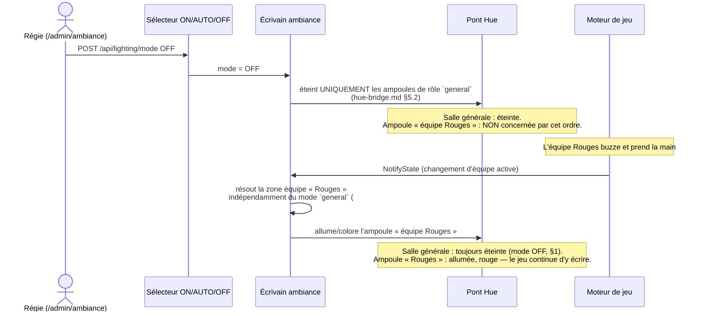
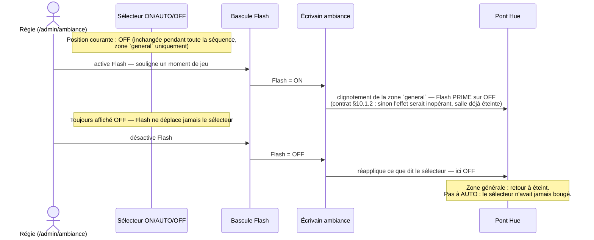

# Éclairage — mode manuel (ON/AUTO/OFF + Flash) et cycle de restitution (#208)

> Support 2 de la maquette T1.3 (Batch 1, reprise milestone v10.0.0). Complète
> `docs/mockups/lighting-team-assignment-213.html` §01/§03. Référence normative :
> `contracts/lighting.md` §10.1, SHA `df448318` (en vigueur).

## 0. Ce document remplace deux versions obsolètes

**Sur la tenue du mode.** Une première version de ce diagramme montrait un **écrasement
automatique** de la conduite manuelle par le prochain événement de jeu — le modèle envisagé quand
ces commandes vivaient encore sur `/anim`. Une formulation intermédiaire (annulation automatique
**avec** retour visuel du sélecteur) a même existé un instant sur la branche (commit `1525c96a`)
avant d'être revertée le jour même — **elle n'a jamais été en vigueur**. **Le design confirmé est
l'inverse** : le mode **tient indéfiniment**, y compris pendant une partie. Seul un retour
**manuel** sur **AUTO** — ou l'arrêt du serveur — rend la main au jeu.

**Sur la portée.** Une révision suivante avait décrit le sélecteur comme agissant sur « toutes les
ampoules pilotées, zones d'équipe comprises » — **également erroné**, écarté par l'utilisateur.
**Le sélecteur (et Flash) ne portent que sur la zone `general`** (`hue-bridge.md` §5.2). Les
ampoules d'une équipe nommée dans l'état courant restent **toujours** pilotées par #213, quelle
que soit la position du sélecteur.

**Sur la nature de l'outil.** Ce n'est pas un outil de configuration qu'on n'utiliserait qu'entre
deux parties : c'est un instrument de **conduite en direct**, utilisé par la **régie** *pendant*
une partie, en réaction au jeu.

Si un document (ticket, capture, mémoire d'agent) montre encore l'une de ces trois formulations, il
est périmé.

## 1. Tenue face aux événements de jeu — le mode ne bouge pas

```mermaid
sequenceDiagram
    actor Regie as Régie (/admin/ambiance)
    participant Sel as Sélecteur ON/AUTO/OFF (état serveur)
    participant Writer as Écrivain ambiance
    participant Hue as Pont Hue
    participant Game as Moteur de jeu

    Regie->>Sel: POST /api/lighting/mode OFF
    Sel->>Writer: mode = OFF
    Writer->>Hue: éteint la zone `general` uniquement<br/>(portée exacte : §2 ci-dessous)
    Note over Sel: Position affichée : OFF

    rect rgb(30, 30, 30)
    Note over Game,Writer: Pendant toute la suite de la partie — buzz, révélation,<br/>changement d'équipe, entracte, fin de manche...
    Game->>Writer: NotifyState (événement de jeu, quel qu'il soit)
    Writer->>Writer: mode courant = OFF → l'événement<br/>n'a AUCUN effet sur la zone `general` (contrat §10.1.1 pt.1)
    Note over Hue: La zone `general` ne bouge pas — elle reste éteinte
    end

    Regie->>Sel: clic "AUTO" (retour manuel, seul chemin)
    Sel->>Writer: mode = AUTO
    Writer->>Writer: re-dérive depuis l'état de jeu COURANT<br/>(même code que §10.3 — rien n'est mémorisé puis restauré)
    Writer->>Hue: applique la scène de jeu actuelle à la zone `general`
    Note over Sel: Position affichée : AUTO
```

**Ce que ce diagramme rend visible :** la boucle « pendant toute la partie » ne produit **aucune**
écriture vers la zone `general` — c'est le point normatif du contrat (§10.1.1, point 1 : « les
événements de jeu ne le recouvrent pas »). Le seul chemin qui fait bouger le sélecteur est le clic
explicite de la régie sur AUTO. Un `OFF` oublié reste `OFF` jusqu'à ce geste, ou jusqu'à l'arrêt du
serveur (§4).

## 2. Portée — zone `general` seule, l'équipe active continue de jouer

**Ce que ce diagramme rend visible :** le mode `general` et la dérivation par équipe (#213) sont
**deux écritures indépendantes** vers le même pont, jamais une seule couplée à l'autre. Un OFF
« général » ne se propage pas aux ampoules d'équipe — c'est délibéré : la régie efface la salle,
elle ne débranche jamais l'information « quelle équipe joue ».

Deux cas où un OFF éteint quand même **tout**, équipe comprise — ils découlent de la même règle de
zone (`hue-bridge.md` §5.2 : la zone `general` inclut « toute ampoule d'équipe dont l'équipe n'est
**pas** nommée dans l'état courant »), ce ne sont pas des exceptions séparées :

| Cas | Pourquoi OFF couvre tout |
|---|---|
| Hors partie, ou aucune équipe nommée dans l'état courant | Toutes les ampoules d'équipe appartiennent alors à `general` |
| Installation sans aucune ampoule d'équipe dédiée (`hue-bridge.md` §5.7) | La couleur d'équipe est portée par la scène générale elle-même — `general` est tout ce qu'il y a |

## 3. Flash — précédence sans déplacer le sélecteur

**Ce que ce diagramme rend visible :** Flash et le sélecteur sont deux états **indépendants** qui
coexistent, même portée (zone `general`) — Flash a la priorité sur ce que montre cette zone tant
qu'il est actif, mais ne touche jamais à ce qu'affiche le sélecteur, ni aux ampoules d'équipe (§2).
À l'arrêt de Flash, c'est le sélecteur, resté inchangé, qui redevient déterminant.

## 4. Cycle de restitution — trois situations, une seule qui agit directement

```mermaid
sequenceDiagram
    participant Game as Moteur de jeu
    participant App as (*App).stop()
    participant Sel as Sélecteur ON/AUTO/OFF
    participant Writer as Écrivain ambiance
    participant Hue as Pont Hue
    participant Buzz as LED buzzers

    rect rgb(30, 30, 30)
    Note over Game: Fin de partie
    Game->>Writer: (aucune action de restitution)
    Note over Writer,Hue: La dernière scène affichée reste affichée —<br/>y compris un mode ON/OFF resté engagé sur `general`. Hors périmètre v10.0.0 (contrat §10.2)
    end

    rect rgb(30, 30, 30)
    Note over Hue: Perte du pont en cours de partie
    Hue--xWriter: injoignable (timeout 2s)
    Writer->>Writer: n'agit pas — seul le badge de statut<br/>admin reflète la perte (hue-bridge.md §5.6)
    Note over Hue: ...le pont revient...
    Hue-->>Writer: reconnecté
    Writer->>Sel: relit le mode COURANT de `general` (pas forcément AUTO)
    Writer->>Hue: réapplique CE mode sur `general` : ON, OFF, ou la scène<br/>de jeu si AUTO — les zones d'équipe se re-dérivent normalement (contrat §10.3)
    end

    rect rgb(58, 30, 12)
    Note over App: Arrêt du serveur — seul cas des trois qui agit,<br/>et SEUL mécanisme qui couvre TOUTES les ampoules (pas que `general`)
    App->>Writer: extinction totale, AVANT a.cancelCtx()
    Note over App,Writer: Contexte propre à échéance courte (1-2s), jamais a.ctx (§10.4).<br/>S'applique QUEL QUE SOIT le mode courant de `general` — pas besoin<br/>de le ramener sur AUTO d'abord (contrat §10.1.1 pt.8)
    Writer->>Hue: éteint TOUTES les ampoules pilotées — general ET équipes
    Writer->>Buzz: éteint les LED des buzzers
    App->>App: cancelCtx() — arrêt normal des autres composants
    Note over Hue,Buzz: Pont injoignable à l'arrêt = cas normal,<br/>au plus une ligne de log — n'empêche jamais l'arrêt
    end
```

**Ce que ce diagramme rend visible :** sur les trois situations qui auraient pu déclencher une
restitution, **une seule agit directement** sur l'éclairage (l'arrêt serveur, et il doit le faire
**avant** `cancelCtx()`). C'est aussi la **seule** des trois qui dépasse la zone `general` : le
mode ON/AUTO/OFF (§1-§3) et sa resynchronisation ne concernent que cette zone, mais l'extinction
d'arrêt serveur (§10.4) couvre **toutes** les ampoules pilotées, équipes comprises — c'est une
extinction totale de l'installation, pas un mode. Le retour du pont **n'est pas** une restitution
neutre : il **réapplique le mode courant** de `general`, qui peut très bien être `ON` ou `OFF` resté
engagé depuis avant la coupure.

## 5. Table récapitulative

| Situation | Zone `general` | Zones d'équipe (#213) | Ce qui se passe |
|---|---|---|---|
| Événement de jeu pendant un mode ON/OFF/Flash engagé | **Ne bouge pas** (§1) | Continue de suivre le jeu normalement (§2) | Seul un retour manuel sur AUTO change quelque chose |
| Fin de partie | Reste sur le dernier mode/scène | Reste sur la dernière couleur | Hors périmètre v10.0.0 |
| Perte du pont en cours de partie | Inchangé pendant la coupure | Inchangé pendant la coupure | Au retour, réapplication du **mode courant** de `general` (§4) |
| Arrêt du serveur | **Éteinte** | **Éteinte** | **Seul cas** qui couvre tout, avant `cancelCtx()` |

## 6. Ce que ces diagrammes ne couvrent pas

- Les quatre règles de dégradation de #213 (moins d'ampoules que d'équipes, équipe sans ampoule,
  aucune affectation, ampoule injoignable) : voir
  `docs/mockups/lighting-team-assignment-213.html` §01 et `contracts/hue-bridge.md` §5.7.
- Le contenu exact des scènes (couleurs, intensités) : table de scènes v1, `contracts/lighting.md`
  §8 — inchangée par #208, confirmé au GATE du 2026-09-07.
- Le canal de transport (`POST /api/lighting/mode`, `/api/lighting/flash` — HTTP REST, jamais
  WebSocket, contrat §10.1.3) : ce document illustre la logique, pas la forme exacte des requêtes.
- La persistance : le mode n'est **pas** persisté (contrat §10.1.1 pt.5) — un redémarrage serveur
  repart toujours sur AUTO, même si la régie avait laissé OFF engagé avant l'arrêt.

---
Maquette produite en phase Plan (T1.3, Batch 1) · révision 3 — à valider, GATE 2 · corrige la
portée (zone `general` seule, jamais les équipes) et le cadrage (outil de conduite en direct pour
la régie, pas un outil de configuration hors-partie) de la révision 2 · référence pour dev-frontend
(Batch 3), test-writer (T1.4) et qa · issue #208 · milestone v10.0.0 · BuzzControl
